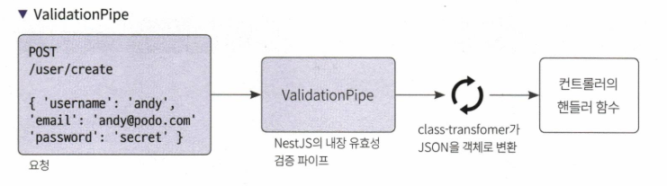
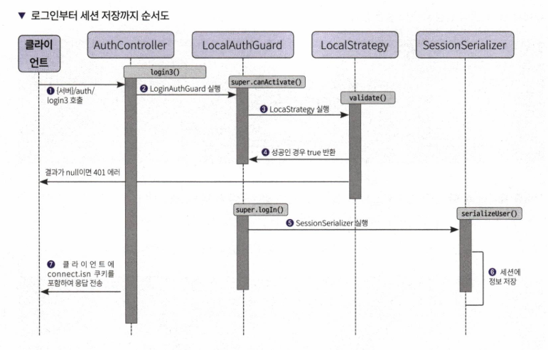

# 10장

## 10.1 실습용 프로젝트 설정하기
- ``` 
    // nest 프로젝트 생성
    nest new nest-auth-test 
    ```
- ```
    // User 모듈, 컨트롤러, 서비스 생성
    nest g module user
    nest g controller user --no-spec
    nest g service user --no-spec
    ```
- 
    ```typescript
    // sqlite 데이터베이스 설정
    import { Module } from '@nestjs/common';
    import { AppController } from './app.controller';
    import { AppService } from './app.service';
    import { UserModule } from './user/user.module';
    import { TypeOrmModule } from '@nestjs/typeorm';

    @Module({
    imports: [
        TypeOrmModule.forRoot({ // sqlite 설정 메서드
        type: 'sqlite', // ① 데이터베이스의 타입 
        database: 'nest-auth-test.sqlite', // ② 데이터베이스 파일명 
        entities: [User], // ③ 엔티티 리스트 
        synchronize: true, // ④ 데이터베이스에 스키마를 동기화 
        logging: true, // ⑤ SQL 실행 로그 확인 
        }),
        UserModule,
    ],
    controllers: [AppController],
    providers: [AppService],
    })
    export class AppModule {}
    ```

## 10.2 유저 모듈의 엔티티, 서비스, 컨트롤러 생성하기

```typescript
// 유저 엔티티 정의
import { Column, Entity, PrimaryGeneratedColumn } from 'typeorm';

@Entity() // ② 엔티티 객체임을 알려주기 위한 데코레이터 
export class User {
  @PrimaryGeneratedColumn()
  id?: number; // ③ id는 pk이며 자동 증가하는 값 
  @Column({ unique: true })
  email: string; // ④ email은 유니크한 값 

  @Column()
  password: string;

  @Column()
  username: string;

  @Column({ default: true }) // ⑤ 기본값을 넣어줌 
  createdDt: Date = new Date();
}
```

```typescript
// 유저 모듈 생성
// 리포지토리를 모듈에 등록해야 서비스에서 리포지토리를 찾을 수 있음
import { Module } from '@nestjs/common';
import { UserController } from './user.controller';
import { UserService } from './user.service';
import { TypeOrmModule } from '@nestjs/typeorm';
import { User } from './user.entity';

@Module({
  imports: [TypeOrmModule.forFeature([User])],
  controllers: [UserController],
  providers: [UserService],
})
export class UserModule {}
```

```typescript

// user 서비스 생성

import { Injectable } from '@nestjs/common';
import { InjectRepository } from '@nestjs/typeorm';
import { Repository } from 'typeorm';
import { User } from './user.entity';

@Injectable() // ① 의존성 주입을 위한 데코레이터 (Decorator for dependency injection)
export class UserService {
  constructor(
    // ② 리포지토리 주입 (Inject repository)
    @InjectRepository(User) private userRepository: Repository<User>,
  ) {}

  // ③ 유저 생성 (Create user)
  createUser(user: User): Promise<User> {
    return this.userRepository.save(user);
  }

  // ④ 한 명의 유저 정보 찾기 (Find a user by email)
  async getUser(email: string) {
    const result = await this.userRepository.findOne({
      where: { email },
    });
    return result;
  }

  // ⑤ 유저 정보 업데이트. username과 password만 변경 (Update user information: only username and password)
  async updateUser(email: string, _user: Partial<User>) {
    const user: User = await this.getUser(email);
    console.log(_user);
    user.username = _user.username;
    user.password = _user.password;
    console.log(user);
    this.userRepository.save(user);
  }

  // ⑥ 유저 정보 삭제 (Delete user by email)
  deleteUser(email: string) {
    return this.userRepository.delete({ email });
  }
}

```

| 메서드      | 설명                                                                                             |
|-------------|--------------------------------------------------------------------------------------------------|
| **find**    | SQL에서 select와 같은 역할을 하며 conditions에 쿼리 조건을 넣어주면 됩니다.                            |
|             | ```find(conditions?: FindConditions<Entity>): Promise<Entity[]>```                                |
|             | - 반환값: `Promise<Entity[]>`                                                                     |
|             | - 사용 예시: `find({email: andy@podo.com })`                                                      |
| **findOne** | 값은 하나만 찾을 때 사용합니다.                                                                    |
|             | ```findOne(id?: string \| number \| Date \| ObjectID, options?: FindOneOptions<Entity>)```         |
|             | ```findOne(options?: FindOneOptions<Entity>)```                                                   |
|             | ```findOne(conditions?: FindConditions<Entity>, options?: FindOneOptions<Entity>)```              |
|             | - 반환값: `Promise<Entity>`                                                                       |
|             | - 사용 예시: `findOne({email: andy@podo.com })`                                                   |
| **findAndCount** | find로 검색해오는 객체의 더불어 count가 필요한 경우 사용합니다.                                      |
|                 | ```findAndCount(options?: FindManyOptions<Entity>)```                                          |
|                 | ```findAndCount(conditions?: FindConditions<Entity>)```                                        |
|                 | - 반환값: `Promise<[Entity[], number]>`                                                       |
|                 | - 사용 예시: `findAndCount({})`                                                               |
| **create**  | 새로운 엔티티 인스턴스를 만들 때 사용합니다. `user가 UserEntity` 타입이라면 다음과 같이 사용할 수 있습니다. |
|             | ```user.create()```                                                                               |
| **update**  | 엔티티의 일부를 업데이트할 때 사용합니다. 조건과 변경해야 하는 엔티티값에 대해 업데이트 쿼리를 실행합니다. 엔티티데이터가 데이터베이스에 존재하는지는 확인하지 않습니다. |
|             | ```update(조건, Partial<Entity>, 옵션)```                                                         |
|             | - 결과값: `Promise<UpdateResult>`                                                                 |
|             | - 사용 예시: `update({email: andy@podo.com}, {username: 'test2'})`                                |
| **save**    | 엔티티를 데이터베이스에 저장합니다. 엔티티가 없으면 insert를 하고 있으면 update를 합니다.                |
|             | ```save(T): T[]```                                                                                |
|             | - 반환값: `Promise<T[]>`                                                                          |
|             | - 사용 예시: `save(user)` 또는 `save(users)`                                                     |
| **delete**  | 엔티티가 데이터베이스에 있는지 체크하지 않고 조건에 해당하는 delete 쿼리를 실행합니다.                   |
|             | ```delete(조건)```                                                                                |
|             | - 반환값: `Promise<DeleteResult>`                                                                 |
|             | - 사용 예시: `delete({email: 'andy@podo.com'})`                                                   |
| **remove**  | 받은 엔티티를 데이터베이스에서 삭제합니다.                                                             |
|             | ```remove(entity: Entity)```                                                                      |
|             | ```remove(entity: Entity[])```                                                                    |
|             | - 반환값: `Promise<Entity[]>`                                                                     |
|             | - 사용 예시: `remove(user)`                                                                       |


```typescript
// 컨트롤러 생성
import { Body, Controller, Get, Post, Param, Put, Delete } from '@nestjs/common';
import { User } from './user.entity';
import { UserService } from './user.service';

@Controller('user') // ① 컨트롤러 설정 데코레이터 (Controller decorator)
export class UserController {
  constructor(private userService: UserService) {} // ② 유저 서비스 주입 (Inject UserService)

  @Post('/create')
  createUser(@Body() user: User) { // ③ 유저 생성 (Create user)
    return this.userService.createUser(user);
  }

  @Get('/getUser/:email')
  async getUser(@Param('email') email: string) { // ④ 한 명의 유저 찾기 (Find a user by email)
    const user = await this.userService.getUser(email);
    console.log(user);
    return user;
  }

  @Put('/update/:email')
  updateUser(@Param('email') email: string, @Body() user: User) { // ⑤ 유저 정보 업데이트 (Update user information)
    console.log(user);
    return this.userService.updateUser(email, user);
  }

  @Delete('/delete/:email')
  deleteUser(@Param('email') email: string) { // ⑥ 유저 삭제 (Delete user)
    return this.userService.deleteUser(email);
  }
}
```


## 10.3 파이프로 유효성 검증하기



```typescript
// 전역 ValidationPipe 설정
import { ValidationPipe } from '@nestjs/common'; // validationPipe 임포트
import { NestFactory } from '@nestjs/core';
import { AppModule } from './app.module';

async function bootstrap() {
  const app = await NestFactory.create(AppModule);
  app.useGlobalPipes(new ValidationPipe()); // 전역 파이프에 validationPipe 객체 추가
  await app.listen(3000);
}
bootstrap();
```

```typescript
// ① IsEmail, IsString 임포트
import { IsEmail, IsString } from 'class-validator';

// ② email, password, username 필드를 만들고 데코레이터 붙이기 
export class CreateUserDto {
  @IsEmail()
  email: string;

  @IsString()
  password: string;

  @IsString()
  username: string;
}

// ③ 업데이트의 유효성 검증 시 사용할 DTO 
export class UpdateUserDto {
  @IsString()
  username: string;

  @IsString()
  password: string;
}
```

## 10.6 패스포트와 세션을 사용한 인증구현

- 패스포트는 인증에 가드를 사용할 수 있도록 감싸둔 AuthGuard를 제공하는 라이브러리
- 패스포트는 인증 로직을 스트래티지라는 개념으로 구현
- 가드를 사용하려면 canActivate를 구현
- super.login()에서 로그인 처리를 하는데, 여기서는 세션을 저장
- AuthenticatedGuard는 로그인 후 인증이 되었는지 확인할 때 사용
