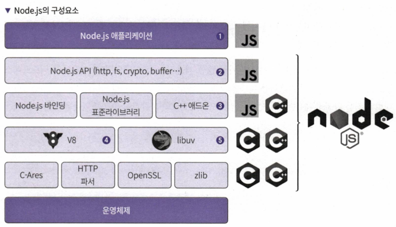
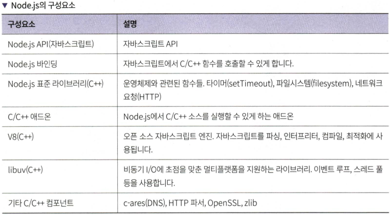
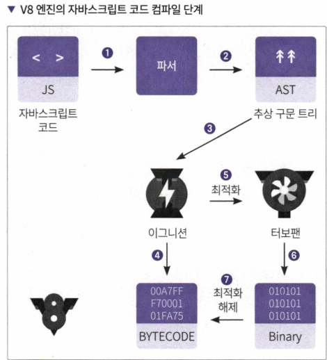
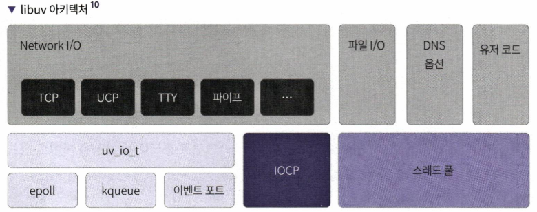
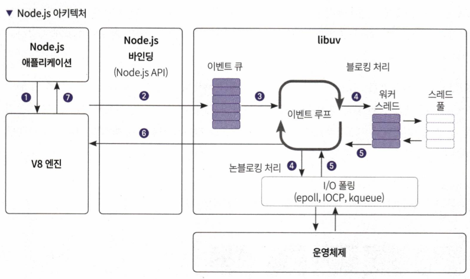
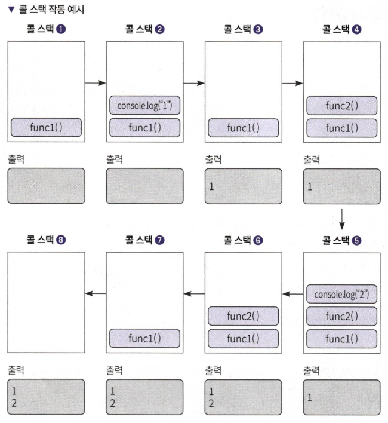
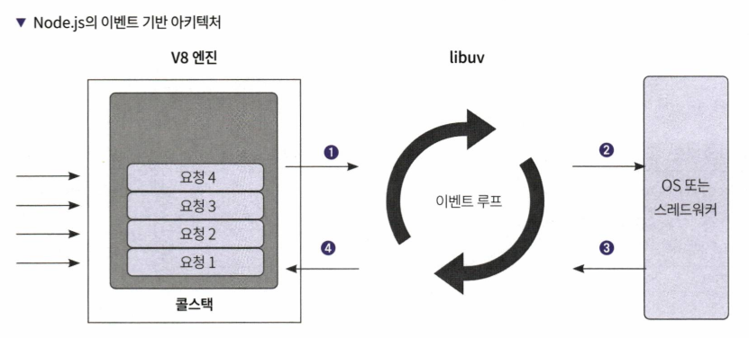

# 2장 node.js로 백엔드 입문하기

## 2.1 Node.js 소개

- 서버 측 자바스크립트 런타임 환경
- V8 엔진
- 이벤트 기반 비동기 환경

## 2.2 Node.js는 서버에서 어떻게 자바스크립트를 실행할까?

- Node.js는 V8 자바스크립트 엔진과 libuv 및 C/C++에 의존성을 가진 자바스크립트 런타임

> Node.js의 구성요소

1. 사용자 코드
2. Node.js의 API를 사용
3. Node.js API는 C++에 바인딩되어 있는 소스이거나 직접 만든 C++ 애드온을 호출
4. C++에서는 V8을 사용해 자바스크립트를 해석 및 최적화하고 어떤 코드냐에 따라 C/C++ 종속성이 있는 코드를 실행

> V8 엔진

- C++로 만든 오픈 소스 자바스크립트 엔진
- 이그니션 : 인터프리터 역할
- 터보팬 : 컴파일러 역할

1. 자바스크립트 코드가 파서에 전달
2. 추상 구문 트리로 만들어짐
3. 이그니션 인터프리터에 전달 -> 추상 구문 트리를 바이트 코드로 만듦
4. 최적화가 필요한 경우에는 터보팬에서 컴파일 과정을 거쳐서 바이너리 코드가 됨

> 이벤트 루프와 운영체제 단 비동기 API 및 스레드 풀을 지원하는 libuv

- Node.js에서 HTTP, 파일, 소켓 통신 IO 기능 등 자바스크립트에는 없는 기능을 어떻게 제공하는가?
  - libuv라는 C++ 라이브러리를 사용해 해결
  - 자바스크립트로 C++ 코드를 감싸서 사용하는 방식
    

> Node.js 아키텍처

- 자바스크립트 코드 실행 : V8
- 이벤트 루프 및 운영체제 시스템 API : libuv
  

1. 애플리케이션에서 요청 발생, V8 엔진은 자바스크립트 코드로 된 요청을 바이트 코드나 기계어로 변경
2. 자바스크립트로 작성된 Node.js의 API는 C++로 작성된 코드를 사용
3. V8 엔진은 이벤트 루프로 libuv를 사용하고 전달된 요청을 libuv 내부의 이벤트 큐에 추가
4. 이벤트 큐에 쌓인 요청은 이벤트 루프에 전달되고, 운영체제 커널에 비동기 처리를 맡김
5. 운영체제의 커널 또는 워커 스레드가 완료한 작업은 다시 에븐트 루프로 전달
6. 이벤트 루프에서 콜백으로 전달된 요청에 대한 완료 처리를 하고 넘김
7. 완료 처리된 응답을 Node.js 애플리케이션으로 전달

## 2.3 Node.js의 기술적인 특징

- 싱글 스레드, 이벤트 기반 아키텍처

> 싱글 스레드

- V8 엔진은 힙과 콜 스택을 가지고 있음
- 싱글 스레드 : 콜 스택이 한 개 -> 한 번에 하나의 작업만 가능
  

> 이벤트 기반 아키텍처

- 콜 스택에 쌓인 작업을 다른 곳에서 처리한 다음 처리가 완료되었을 때 알람을 받으면 스레드가 처리
- 

1. V8의 콜 스택에 쌓이고 I/O 처리가 필요한 코드는 이벤트 루프로 보내게 됨
2. 이벤트 루프에서는 루프를 실행하면서 운영체제 또는 스레드 워커에 I/O 처리를 맡김
3. 스레드 워커와 운영체제는 받은 요청에 대한 결과를 이벤트 루프로 돌려줌
4. 이벤트 루프에서는 결과값에 대한 코드를 콜 스택에 다시 추가

> 이벤트 루프

- 이벤트 기반 아키텍처를 반응자 패턴으로 구축
- 반응자 패턴
  - 이벤트 디멀티플렉서와 이벤트 큐로 구성
  - 이벤트를 추가하는 주체와 해당 이벤트를 실행하는 주체를 분리하는 구조
  - Node.js의 이벤트 루프 : libuv
