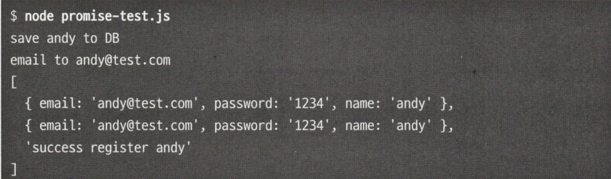
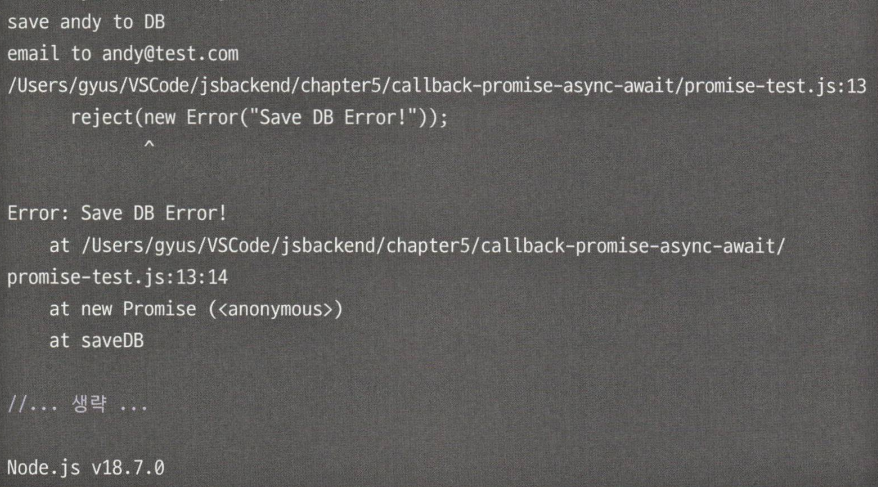
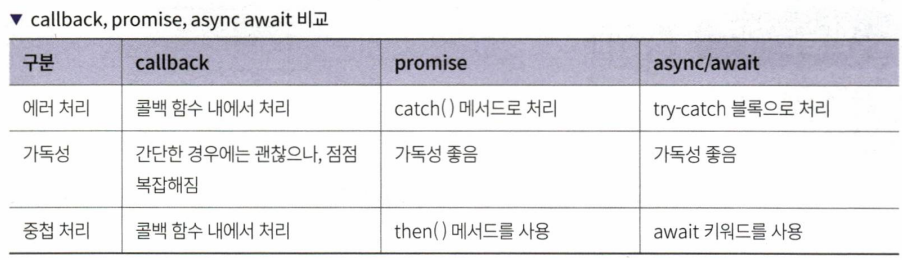

# 5장 자바스크립트에서 비동기 처리하기

## 5.1 자바스크립트 비동기 소개

- 동기 프로그래밍 : 작업은 차례로 실행되며 작업이 완료될 떄까지 중단될 수 없음
- 비동기 프로그래밍 : 임의의 순서 또는 동시에 작업 실행 가능
- 싱글 스레드로 동작하는 자바스크립트에서 비동기를 처리하는 방법
  - 콜백
  - 프로미스
  - 어싱크 어웨이트

## 5.2 콜백 함수 소개

- 비동기 코드를 순서대로 실행하는 가장 일반적인 방안
- 실행 가능한 함수를 인자로 전달하여, 특정 상황이 발생할 때 호출

```tsx
// 회원 가입 API 함수
function register(user) {
  return saveDB(user, function (user) {
    //callback
    return sendEmail(user, function (user) {
      // callback
      return getResult(user); // callback
    });
  });
}
```

- register() → saveDB() → sendEmail() → getResult() 순서로 실행됨
- 콜백의 깊이가 깊어지면 에러를 추적하기가 힘들어짐

## 5.3 Promise 객체

- 비동기 실행을 동기화하는 구문으로 사용됨
- 이행, 불이행, 대기 3가지의 상태를 가짐

```tsx
function registerByPromise(user) {
  const result = saveDB(user).then(sendEmail).then(getResult);
  console.log(result);
  return result;
}

function sendEmail(user) {
  console.log("send Email");
  return new Promise((resolve, reject) => {
    // 콜백 대신 Promise 객체 반환
    if (success) {
      resolve(user); // 성공 시 유저 정보 반환
    } else {
      reject(new Error("save DB error!")); // 실패 시 에러 발생
    }
  });
}
```

- then() 메서드를 통해 순서대로 함수를 호출할 수 있음
- Promise에서 발생하는 에러에는 .catch()로 에러처리

> 동시에 여러 Promise 객체 호출하기

- Promise.all([Promise1, Promise2, ...])
- 나열된 순서 상관없이 동시에 실행되고 결과는 배열로 반환됨

```tsx
const myUser = { email: "andy@test.com", password: "1234" };
allResult = Promise.all([saveDB(myUser), sendEmail(myUser), getResult(myUser)]);
allResult.then(console.log);
```



> Promise 예외 처리하기

```tsx
function registerByPromise(user) {
  const result = saveDB(user)
    .then(sendEmail)
    .then(getResult)
    .catch((error) => new Error(error));
  console.log(result);
  return result;
}
```



- 에러가 난 부분을 알 수 있다는 장점

> finally 메서드

- 비동기 처리의 성공, 실패 여부와 관계없이 실행할 수 있게 해주는 메서드

```tsx
function registerByPromise(user) {
  const result = saveDB(user)
    .then(sendEmail)
    .then(getResult)
    .catch((error) => new Error(error))
    .finally(() => console.log("완료"));
}
```

> 프로미스의 문제점

- then()과 catch() 함수를 연결하는 체이닝 방식을 사용하기가 까다로움

## 5.4 async await 구문

> async

- async 뒤에는 함수가 붙음 → async function
- async가 붙은 함수는 프로미스를 반환함

```tsx
async function myName() {
  return "Andy";
}
console.log(myName());

// Promise { 'Andy'}
```

- Promise로 반환값이 감싸져서 나옴
  > await
- 성공 또는 실패로 Promise 객체의 실행이 완료되기를 기다림
- await 뒤에는 Promise가 붙음
- await는 async 키워드를 사용한 함수 안에서만 사용할 수 있음

```tsx
async function myName() {
  return "Andy";
}

async function showName() {
  const name = await myName();
  console.log(name);
}

console.log(showName());

// Promise {<pending>}
// Andy

// 위의 코드를 예외처리하는 방법 → try catch 구문
try {
  const name = await myName();
  console.log(name);
} catch (err) {
  throw new Error(err);
}
```


