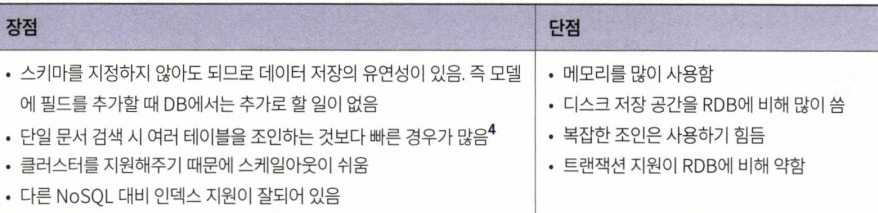
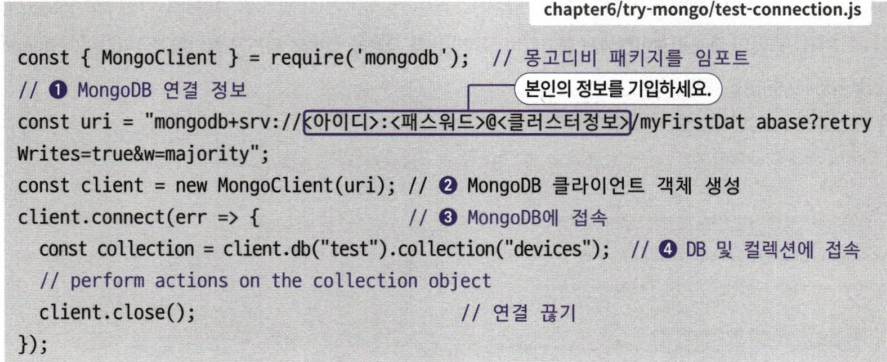

# 6장 NoSQL 데이터베이스 몽고디비 사용하기

## 6.1 몽고디비 소개

- NoSQL 데이터베이스
- 데이터베이스 모델 : 도큐먼트 타입
  - 키-밸류 : 키를 기준으로 데이터를 조회하고 값으로 데이터를 저장
  - 도큐먼트 : JSON과 유사한 형식의 객체를 담은 데이터를 저장
  - 그래프 : 노드를 사용하여 데이터를 저장하고, 에지를 사용해 데이터 관계를 저장

> 몽고디비 특징

- 데이터 포맷 : BSON → Binary JSON (JSON을 바이너리 형식으로 저장)
  

## 6.2 몽고디비 아틀라스 설정하기

- https://www.mongodb.com/atlas
  

## 몽고디비 CRUD API 만들기

```tsx
const MongoClient = require('mongodb').MongoClient;
const url = mongodb+srv://<아이디>:<패스워드>@<클러스터정보>test?retryWrites=true&w=majority';

// 1. mongoClient 생성
const client = new MongoClient(url, { useNewUrlParser: true});

async function main() {
  try {
    // 2. 커넥션을 생성하고 연결 시도
    await client.connect();

    console.log('MongoDB 접속 성공');

    // 3. test 데이터베이스의 person 컬렉션 가져오기
    const collection = client.db('test').collection('person');

    // 4. 문서 하나 추가
    await collection.insertOne({name: "Andy", age:30});
    console.log('문서 추가 완료');

    // 5. 문서 찾기
    const documents = await collection.find({name:'Andy'}).toArray();
    console.log('찾은 문서:', documents);

    // 6. 문서 갱신하기
    await collection.updateOne({name: 'Andy'}, {$set: {age: 31}});
    console.log('문서 업데이트');

    // 7. 갱신된 문서 확인하기
    const updateDocuments = await collection.find({name:'Andy'}).toArray();
    console.log('갱신된 문서:', updateDocuments);

    // 8. 문서 삭제하기
    await collection.deleteOne({name:'Andy'});
    console.log("문서 삭제");

    // 연결 끊기
    await client.close();
  } catch (err) {
    console.log(err);
  }
}
```

## 6.5 몽구스를 사용해 CRUD 만들기

```tsx
npm install mongoose
```

> 몽구스로 스키마 만들기

```tsx
var mongoose = require("mongoose");
var Schema = mongoose.Schema;

// 스키마 객체 생성
const personSchema = new Schema({
  name: String,
  age: Number,
  email: { type: String, required: true },
});

// 모델 객체 생성
module.exports = mongoose.model("Person", personSchema);
```

- 스키마를 생성할 때 타입을 선언 가능
- 스키마의 속성의 기본값, 필수 여부 등을 설정 가능

> 몽구스와 익스프레스로 CRUD API 만들기

```tsx
const express = require("express");
const bodyParser = require("body-parser");
const mongoose = require("mongoose");
const Person = require("./person-model");

// 설정해줘야 경고가 뜨지 않음
mongoose.set("stricQuery", false);

const app = express();
app.use(bodyParser.json()); // HTTP에서 Body를 파싱하기 위한 설정
app.listen(3000, async () => {
  console.log("server started");
  const mongodbUri = "mongodb+srv:...";

  // 몽고디비에 커넥션 맺기
  mongoose.connect(mongodbUri, { useNewUrlParser: true }).then(console.log("connected to mongoDB"));
});

// 모든 person 데이터 출력
app.get("/person", async (req, res) => {
  const person = await Person.find({});
  res.send(person);
});

// 특정 이메일로 person 찾기
app.get("/person/:email", async (req, res) => {
  const person = await Person.findOne({ email: req.params.email });
  res.send(person);
});

// person 데이터 추가하기
app.post("/person", async (req, res) => {
  const person = new Person(req.body);
  await person.save();
  res.send(person);
});

// person 데이터 수정하기
app.put("/person/:email", async (req, res) => {
  const person = await Person.findOneAndUpdate(
    { email: req.params.email },
    { $set: req.body },
    { new: true }
  );
  console.log(person);
  res.send(person);
});

// person 데이터 삭제하기
app.delete("/person/:email", async (req, res) => {
  await Person.deleteMany({ email: req.params.email });
  res.send({ success: true });
});
```

## 6.6 REST 클라이언트로 API 테스트하기

- extensions에서 rest client를 설치

```tsx
@server = http://localhost:3000

GET {{server}}/person

POST {{server}}/person
Content-Type:application/json

{
  "name":"Andy Park",
  "age":30,
  "email":"andy@backend.com"
}

GET {{server}}/person/andy@backend.com

PUT {{server}}/person/andy@backend.com
Content-Type: application.json
{
  "age":32
}

DELETE {{sever}}/person/andy@backend.com
```
