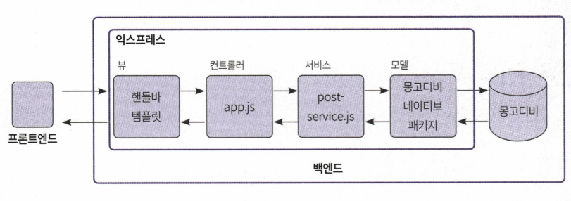
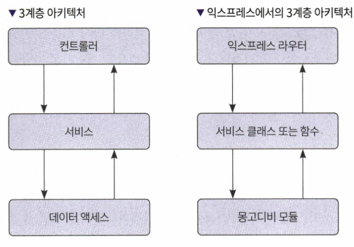
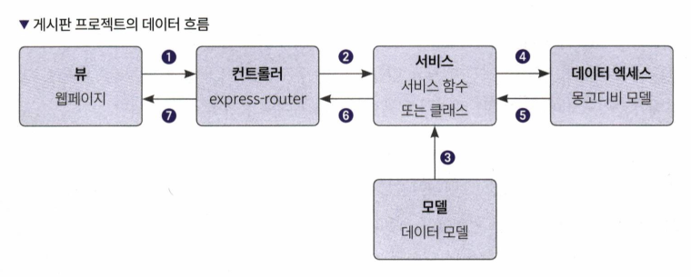
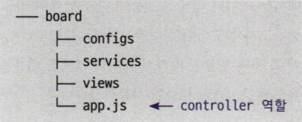

# 7장 페이지네이션되는 게시판 만들기

## 7.1 프로젝트 구조 소개


## 7.2 게시판 프로젝트 셋업
- npm init -y를 사용해 package.json을 생성

```json
// package.json
{
  "name": "board", // 프로젝트명 (Project Name)
  "version": "1.0.0", // 버전 (Version)
  "description": "", // 설명 (Description)
  "main": "index.js", // ① 메인 파일 (Main File)
  "scripts": {
    "test": "echo \"Error: no test specified\" && exit 1" // ② npm test로 실행하는 스크립트 (Script executed with `npm test`)
  },
  "keywords": [], // 패키지 업로드 시 검색어 (Keywords for package upload)
  "author": "", // 작성자 (Author)
  "license": "ISC" // 라이선스 (License)
}
```
- 3계층 아키텍처



1. 웹페이지에서 익스프레스로 요청을 보냄
2. 컨트롤러에서 받은 요청에 대한 인증, 유효성 검증을 하고 서비스 계층의 함수를 호출
3. 데이터 액세스로 넘기는 모델 객체를 생성
4. 받은 데이터 CRUD 수행
5. 결과 리턴
6. 결과 리턴
7. 응답 리턴



```javascript
// app.js 파일
const express = require("express");
const handlebars = require("express-handlebars");
const app = express();

app.engine("handlebars", handlebars.engine()); // ① 템플릿 엔진으로 핸들바 등록 
app.set("view engine", "handlebars"); // ② 웹페이지 로드 시 사용한 템플릿 엔진 설정 
app.set("views", __dirname + "/views"); // ③ 뷰 디렉터리를 views로 설정 

// ④ 라우터 설정 (Setting up the router)
app.get("/", (req, res) => {
  res.render("home", { title: "안녕하세요", message: "만나서 반갑습니다!" }); 
});

app.listen(3000);
```

## 7.5 API 만들기

### 7.5.1 몽고디비 연결을 위한 유틸리티 만들기


```javascript
// mongodb-connection.js
const { MongoClient } = require("mongodb");

// ① 몽고디비 연결 주소 (MongoDB connection URI)
const uri = "mongodb+srv://<아이디>:<패스워드>@<클러스터정보>/test"; 

module.exports = function(callback) { // ② 몽고디비 커넥션 연결 함수 반환
  return MongoClient.connect(uri, callback);
};
```


```javascript
// app.js
const express = require("express");
const handlebars = require("express-handlebars");

const app = express();

// ① 몽고디비 연결 함수
const mongodbConnection = require("./configs/mongodb-connection");

// ... 생략 ...

let collection;
app.listen(3000, async () => {
  console.log("Server started");
  
  // ② mongodbConnection()의 결과는 mongoClient 
  const mongoClient = await mongodbConnection();
  
  // ③ mongoClient.db()로 디비 선택 collection()으로 컬렉션 선택 후 collection에 할당
  collection = mongoClient.db().collection("post");
  
  console.log("MongoDB connected");
});
```

- 글쓰기
```javascript
const express = require("express");

// ... 생략 ...

const postService = require("./services/post-service"); // ① 서비스 파일 로딩 

// ... 생략 ...

// 쓰기 페이지 이동 
app.get("/write", (req, res) => {
  res.render("write", { title: "테스트 게시판" });
});

// 글쓰기 
app.post("/write", async (req, res) => {
  const post = req.body;
  
  // ② 글쓰기 후 결과 반환 
  const result = await postService.writePost(collection, post);
  
  // ③ 생성된 도큐먼트의 id를 사용해 상세페이지로 이동 
  res.redirect(`/detail/${result.insertedId}`);
});

// ... 생략 ...

// 글쓰기 
async function writePost(collection, post) { // ① 글쓰기 함수 
  // 생성일시와 조회수를 넣어줍니다. 
  post.hits = 0;
  post.createdDt = new Date().toISOString(); // ② 날짜는 ISO 포맷으로 저장
  return await collection.insertOne(post); // ③ 몽고디비에 post를 저장 후 결과 반환 
}

module.exports = { // ④ require()로 파일을 임포트 시 외부로 노출하는 객체 
  writePost,
};
```

- 글 조회

```javascript
// ... 생략 ...

// 리스트 페이지 
app.get("/", async (req, res) => {
  const page = parseInt(req.query.page) || 1; // ① 현재 페이지 데이터 
  const search = req.query.search || ""; // 검색어 데이터 
  try {
    // ② postService.list에서 글 목록과 페이지네이터를 가져옴 
    const [posts, paginator] = await postService.list(collection, page, search);
    
    // ③ 리스트 페이지 렌더링 (Render the list page)
    res.render("home", { title: "테스트 게시판", search, paginator, posts });
  } catch (error) {
    console.error(error);
    
    // ④ 에러가 나는 경우는 빈 값으로 렌더링
    res.render("home", { title: "테스트 게시판" });
  }
});

// ... 생략 ...
const paginator = require("../utils/paginator");


// 글 목록 
async function list(collection, page, search) {
  const perPage = 10;

  // ① title이 search와 부분일치하는지 확인 
  const query = { title: new RegExp(search, "i") };

  // ② limit는 10개만 가져온다는 의미, skip은 설정된 개수만큼 건너뛴다(skip)
  const cursor = collection.find(query, { limit: perPage, skip: (page - 1) * perPage }).sort({
    createdDt: -1,
  });

  // ③ 검색어에 걸리는 게시물의 총합
  const totalCount = await collection.countDocuments(query);
  const posts = await cursor.toArray(); // ④ 커서로 받아온 데이터를 리스트로 변경 
  
  // ⑤ 페이지네이터 생성 
  const paginatorObj = paginator({ totalCount, page, perPage });
  
  return [posts, paginatorObj];
}

module.exports = {
  list,
  writePost,
};


// 페이지네이션
const lodash = require("lodash"); // ① lodash 임포트 
const PAGE_LIST_SIZE = 10; // ② 최대 몇 개의 페이지를 보여줄지 설정 

// ③ 총 개수, 페이지, 한 페이지에 표시하는 게시물 개수를 매개변수로 받음 
module.exports = ({ totalCount, page, perPage = 10 }) => {
  const PER_PAGE = perPage;
  const totalPage = Math.ceil(totalCount / PER_PAGE); // ④ 총페이지 수 계산 

  // 시작 페이지 : 몫 * PAGE_LIST_SIZE + 1 
  let quotient = parseInt(page / PAGE_LIST_SIZE);
  if (page % PAGE_LIST_SIZE === 0) {
    quotient -= 1;
  }

  const startPage = quotient * PAGE_LIST_SIZE + 1; // ⑤ 시작 페이지 구하기 

  // 끝 페이지 : startPage + PAGE_LIST_SIZE - 1 
  const endPage = startPage + PAGE_LIST_SIZE - 1 < totalPage ? startPage + PAGE_LIST_SIZE - 1 : totalPage; // ⑥ 끝 페이지 구하기 

  const isFirstPage = page === 1;
  const isLastPage = page === totalPage;
  const hasPrev = page > 1;
  const hasNext = page < totalPage;

  const paginator = {
    // ⑦ 표시할 페이지 번호 리스트를 만들어줌 
    pageList: lodash.range(startPage, endPage + 1),
    page,
    prevPage: page - 1,
    nextPage: page + 1,
    startPage,
    lastPage: totalPage,
    hasPrev,
    hasNext,
    isFirstPage,
    isLastPage,
  };

  return paginator;
};
```