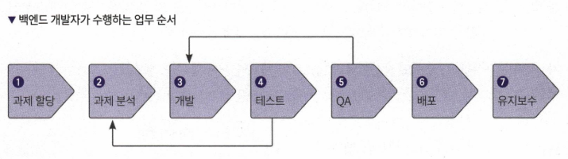
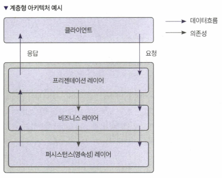
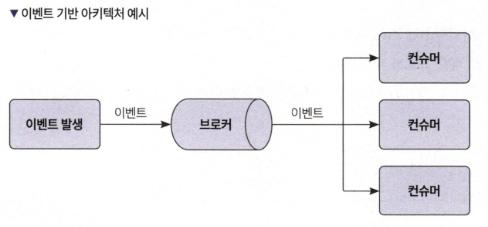
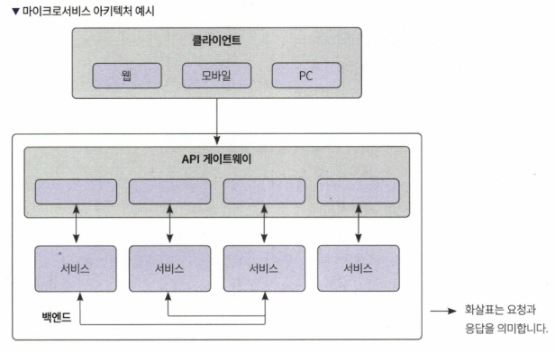
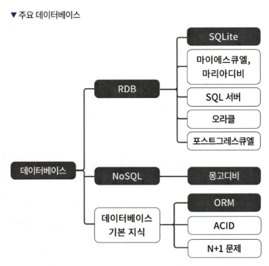

# 0장 개발 환경 구축하기 (생략)

## VSCode 단축키

## 기초 필수 단축키

| 기능                   | 윈도우          | 맥OS             | 우분투           |
|----------------------|----------------|-----------------|----------------|
| 복사하기               | Ctrl + C       | Cmd + C        | Ctrl + C       |
| 잘라내기               | Ctrl + X       | Cmd + X        | Ctrl + X       |
| 붙여넣기               | Ctrl + V       | Cmd + V        | Ctrl + V       |
| 주석 토글             | Ctrl + /       | Cmd + /        | Ctrl + /       |
| 찾기                   | Ctrl + F       | Cmd + F        | Ctrl + F       |
| 바꾸기               | Ctrl + H       | Cmd + H        | Ctrl + H       |
| 전체 파일에서 찾기 | Ctrl + Shift + F | Cmd + Shift + F | Ctrl + Shift + F |
| 사이드바 토글       | Ctrl + B       | Cmd + B        | Ctrl + B       |
| 터미널 토글          | Ctrl + J       | Cmd + J        | Ctrl + J       |
| 탐색기 보기          | Ctrl + Shift + E | Cmd + Shift + E | Ctrl + Shift + E |
| 커서 아래 빈 줄 생성 | Ctrl + Enter  | Cmd + Enter   | Ctrl + Enter  |
| 새로운 탭 열기       | Ctrl + N       | Cmd + N        | Ctrl + N       |
| 새로운 창 열기       | Ctrl + Shift + N | Cmd + Shift + N | Ctrl + Shift + N |
| 탭 닫기               | Ctrl + W       | Cmd + W        | Ctrl + W       |

## 유용한 단축키

| 기능                                      | 윈도우                             | 맥OS                               | 우분투                            |
|-----------------------------------------|---------------------------------|---------------------------------|--------------------------------|
| 설정창 열기                              | Ctrl + , (콤마)                 | Cmd + , (콤마)                 | Ctrl + , (콤마)                |
| 터미널 열기/닫기                         | Ctrl + ` (백틱)                   | Ctrl + ` (백틱)                   | Ctrl + ` (백틱)                 |
| 단축키 설정 열기                         | Ctrl + K, Ctrl + S               | Cmd + K, Cmd + S               | Ctrl + K, Ctrl + S             |
| 블록 주석 처리                           | Alt + Shift + A                  | Opt + Shift + A                 | Alt + Shift + A                |
| 같은 줄 추가                             | Shift + Alt + ↑ 또는 ↓        | Opt + Shift + ↑ 또는 ↓         | Ctrl + Shift + Alt + ↑ 또는 ↓  |
| 빠른 파일 열기                          | Ctrl + P 후 파일명 입력         | Cmd + P 후 파일명 입력          | Ctrl + P 후 파일명 입력        |
| 빠른 라인 이동                          | Ctrl + G 후 라인 번호 입력      | Cmd + G 후 라인 번호 입력       | Ctrl + G 후 라인 번호 입력      |
| 커맨드 팔레트                          | Ctrl + Shift + P                 | Cmd + Shift + P                 | Ctrl + Shift + P                 |
| 특정 문자열 여러 개 찾기              | Ctrl + D                           | Cmd + D                           | Ctrl + D                           |
| 선택한 항목 취소                      | Ctrl + U                           | Cmd + U                           | Ctrl + U                           |
| 자동 코드 포매팅                      | Alt + Shift + F                    | Opt + Shift + F                  | Ctrl + Shift + F                    |
| 커서가 위치한 코드 라인 위 아래로 이동 | Alt + ↑ 또는 ↓                   | Opt + ↑ 또는 ↓                    | Alt + ↑ 또는 ↓                    |
| 방금 전에 닫은 탭 다시 열기          | Ctrl + Shift + T                  | Cmd + Shift + T                  | Ctrl + Shift + T                  |
| 커서가 위치한 함수의 정의로 가기      | F12                                   | F12                                    | F12                                    |
| 커서가 위치한 라인 선택하기          | Ctrl + L                            | Cmd + L                             | Ctrl + L                            |

# 1장 알아두면 좋은 백엔드 개발자를 위한 지식

## 1.1 백엔드 개발자가 알아야 하는 것

- **로드맵**: 백엔드 개발자가 알아야 하는 기술과 지식 로드맵
  - **기술**: 레디스, 맴캐시드, 깃허브 액션, 젠킨스, 도커, 분산 캐시, 유닛 테스트, 통합 테스트, TDD 등.
  - **개발방법론**: 애자일, 스크럼 등의 방법론 이해 필요.

## 1.2 백엔드 개발자의 업무

- **서버 로직 개발 및 유지보수**: 서버 측 로직을 설계, 개발, 유지보수.
- **데이터베이스 관리**: 데이터베이스 설계, 쿼리 최적화 및 관리.
- **API 설계 및 구현**: RESTful API 또는 GraphQL API 설계 및 구현.
- **성능 최적화 및 보안 설정**: 서버 성능 최적화 및 보안 설정.
- **클라우드 서비스 관리**: AWS, Google Cloud, Azure 등 클라우드 서비스 활용.

## 1.3 백엔드 아키텍처

- **계층형 아키텍처**: 프레젠테이션, 애플리케이션, 데이터베이스로 계층화된 구조.
- **이벤트 기반 아키텍처**: 이벤트를 기반으로 비동기적으로 처리.
- **마이크로서비스 아키텍처**: 작은 단위의 독립적인 서비스들로 구성.

## 1.4 백엔드 프로그래밍 언어
- **자바스크립트/타입스크립트**: Node.js 환경에서 많이 사용됨.
- **파이썬**: Django, Flask 프레임워크에서 주로 사용됨.
- **자바/코틀린**: Spring, Vert.x 등에서 사용.
- **고(Golang)**: 성능이 중요한 서비스에 사용.
- **러스트**: 안전성과 성능을 동시에 요구하는 서비스에서 사용.

## 1.5 데이터베이스

### 1.5.1 RDB (관계형 데이터베이스)
- **기본 개념**: 테이블, 행, 열로 구성된 데이터베이스. SQL 사용.
- **대표적인 RDBMS**: MySQL, PostgreSQL, Oracle.

#### ACID 트랜잭션

- **ACID의 정의**: RDB의 특징으로, 각각 원자성(Atomicity), 일관성(Consistency), 격리성(Isolation), 내구성(Durability)을 의미
  - **원자성**: 트랜잭션을 구성하는 명령이 하나의 묶음으로 처리되어 모두 성공하거나 모두 실패하는 것을 보장
  - **일관성**: 트랜잭션 실행 시 데이터베이스의 무결성 조건을 만족
  - **격리성**: 두 개의 트랜잭션이 서로에게 영향을 미치지 않음
  - **내구성**: 트랜잭션이 성공적으로 끝난 후 결과가 데이터베이스에 지속적으로 유지됨

- **ACID 트랜잭션의 중요성**: 데이터베이스에서 데이터의 일관성을 유지하고 보존
  - 문제가 생긴 경우 이전 상태로 되돌릴 수 있음
  - NoSQL 데이터베이스에서도 트랜잭션 지원이 많아짐
  - NoSQL은 보통 분산 데이터베이스를 가정하는 경우가 많아 RDB보다 추가적인 제약이 있음

### 1.5.2 NoSQL (Not Only SQL)
- **기본 개념**: 비관계형 데이터베이스. 스키마가 유연함.
- **종류**: 키-값 저장소, 문서 저장소, 컬럼 지향 저장소, 그래프 저장소.
- **대표적인 NoSQL DB**: MongoDB, Cassandra, Redis.

## 1.6 클라우드 서비스
- **기본 개념**: 인터넷을 통해 제공되는 다양한 컴퓨팅 자원.
- **주요 클라우드 제공 업체**: AWS, Google Cloud Platform, Microsoft Azure.
- **서비스 유형**: IaaS, PaaS, SaaS.

## 1.7 자바스크립트 생태계
### 1.7.1 패키지 매니저
- **npm**: Node.js 패키지 매니저, 가장 많이 사용됨.
- **Yarn**: Facebook에서 개발한 패키지 매니저, 속도와 보안성에서 우수.

### 1.7.2 빌드 도구
- **웹팩(Webpack)**: 모듈 번들러, 자바스크립트 모듈을 번들링함.
- **바벨(Babel)**: 최신 자바스크립트 문법을 구형 브라우저에서도 사용할 수 있게 변환해줌.

### 1.7.3 개발 도구
- **VSCode**: 마이크로소프트에서 개발한 무료 소스 코드 편집기.
- **WebStorm**: JetBrains에서 개발한 자바스크립트 전용 통합 개발 환경.

### 1.7.4 웹 프레임워크
- **Express**: Node.js를 위한 빠르고 간결한 웹 프레임워크.
- **NestJS**: Angular에서 영감을 받아 만든 Node.js를 위한 프레임워크.

### 1.7.5 백엔드 개발 환경
- **로컬 개발 환경 설정**: 로컬에서 개발하기 위한 기본 설정 방법.
- **배포 환경 구성**: 개발한 애플리케이션을 배포하기 위한 환경 구성 방법.

### 1.7.6 인프라
- **클라우드 인프라 관리**: 자바스크립트로 클라우드 인프라를 관리하는 방법(Pulumi 등).

