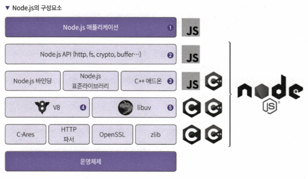
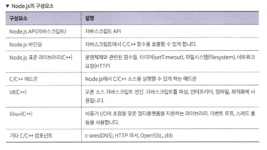
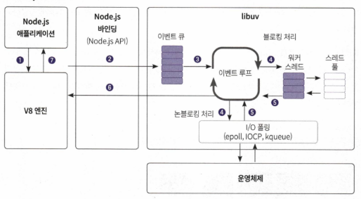
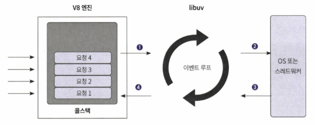
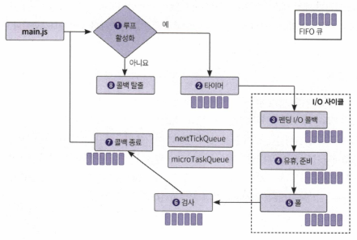
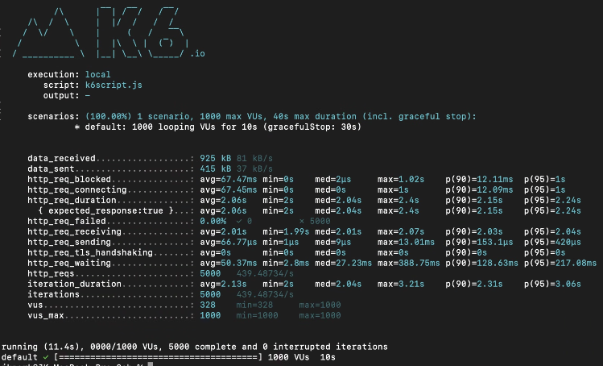

# 2장 Node.js로 백엔드 입문하기

## 2.1 Node.js 소개
- **Node.js**: 서버 사이드 자바스크립트 런타임 환경
  - 비동기 이벤트 기반, 논블로킹 I/O 모델 사용
  - V8 자바스크립트 엔진, libuv 및 C/C++에 의존성 있
  - 2009년 라이언 달이 오픈 소스로 공개

## 2.2 Node.js는 서버에서 어떻게 자바스크립트를 실행할까?
### 2.2.1 Node.js의 구성 요소





- **V8 엔진**: 자바스크립트 코드를 실행하는 엔진
- **libuv**: 이벤트 루프와 비동기 I/O를 처리하는 라이브러리
- **Core Modules**: 파일 시스템, HTTP 등 기본 제공 모듈

### 2.2.2 자바스크립트 실행을 위한 V8 엔진
- C++로 만든 오픈 소스 자바스크립트 엔진(사용자가 작성한 코드를 실행하는 프로그램)
    - 파서, 컴파일러(터보팬), 인터프리터(이그니션), 가비지 컬레겉, 콜 스택, 힙으로 구성
- Just-In-Time 컴파일로 최적화 (런타임에 기계어로 컴파일하는 기법)

### 2.2.3 이벤트 루프와 비동기 API 및 스레드 풀을 지원하는 libuv
- C++ 라이브러리 (비동기 입출력)
    - JS로 C++ 코드를 감싸서 사용 (C++ 바인딩)
- **이벤트 루프**: 비동기 작업을 관리하고 콜백을 실행
    - 리눅스 epoll, 윈도우 IOCP, 맥 kqueue
- **스레드 풀**: 파일 시스템 작업 등 블로킹 작업을 백그라운드에서 처리

### 2.2.4 Node.js 아키텍처



- **싱글 스레드**: 단일 스레드에서 이벤트 루프를 통해 작업 처리
- **비동기 I/O**: 논블로킹 I/O로 높은 처리량 유지

## 2.3 Node.js의 기술적인 특징
### 2.3.1 싱글 스레드

- **싱글 스레드 모델**: 하나의 스레드에서 모든 요청 처리 (콜 스택 하나)
- **동시성 처리**: 비동기 I/O와 이벤트 루프를 통해 동시성 지원

### 2.3.2 이벤트 기반 아키텍처



- **이벤트**: 비동기 작업이 완료되면 콜백 함수 호출
- **콜백**: 특정 이벤트가 발생했을 때 실행되는 함수

### 2.3.3 이벤트 루프

#### 주요 구성 요소
- **반응자 패턴 (Reactor Pattern)**: 이벤트 디멀티플렉서와 이벤트 큐로 구성. 이벤트를 추가하는 주체와 해당 이벤트를 실행하는 주체를 분리함.
- **libuv**: Node.js의 이벤트 루프는 libuv 라이브러리를 사용하여 구현됨. 각 운영체제의 비동기 I/O 계층을 추상화하여 제공함.

#### 이벤트 루프 동작 과정



1. **루프 활성화 확인**
2. **타이머 단계 (Timers Phase)**: `setTimeout()` 및 `setInterval()`과 같은 타이머 콜백을 처리.
3. **I/O 콜백 단계 (I/O Callbacks Phase)**: 연기된 I/O 콜백을 처리.
4. **유휴 준비 단계 (Idle, Prepare Phase)**: 내부적으로 사용.
5. **폴링 단계 (Poll Phase)**: 새로운 I/O 이벤트를 가져오고, 필요한 경우 블로킹하여 I/O를 처리.
6. **체크 단계 (Check Phase)**: `setImmediate()` 콜백을 처리.
7. **종료 콜백 단계 (Close Callbacks Phase)**: 콜백 종료 처리. (fd 닫기 )

#### 특별한 큐
- **nextTickQueue**: 각 단계 사이에서 `process.nextTick()`으로 추가된 작업을 우선 처리.
- **microTaskQueue**: `Promise`의 콜백과 같은 마이크로태스크를 처리. `nextTickQueue`보다 우선순위가 낮음.

#### 코드 예시
```javascript
console.log("1");
setTimeout(() => console.log("2"), 1000);
console.log("3");

// 출력 결과:
// 1
// 3
// 2 (1초 후)
```
- `console.log("1")`과 `console.log("3")`는 즉시 실행됨.
- `setTimeout`의 콜백은 타이머 단계에서 실행됨.


## 2.4 Node.js 과연 쓸만한가?

- **장점**
  - 비동기 이벤트 기반 IO로 높은 처리량
  - 자바스크립트를 사용하여 프론트엔드와 백엔드 통합
  - 풍부한 패키지 생태계
- **단점**
  - 싱글 스레드로 CPU 집약적인 작업에 한계

## 2.5 나의 첫 Node.js 서버 프로그램
### 2.5.1 hello.js 파일 생성 및 실행

- **파일 생성**: `hello.js` 파일을 생성하고 다음 코드 작성

  ```javascript
  const http = require('http');
  let count = 0;

  const server = http.createServer((req, res) => {
    log(count);
    res.statusCode = 200;
    res.setHeader("Content-Type", "text/plain");
    res.write("hello\n");
    setTimeout(() => {
      res.end("Node.js");
    }, 2000);
  });

  function log(count) {
    console.log((count += 1));
  }

  server.listen(3000, () => {
    console.log('Server running at http://localhost:3000/');
  });
  ```

* vscode 에서 실행하려면 `Ctrl+F5`
* 참고. res.write와 res.end 는 stream에 대한 작업이라 함수 호출 직후 클라로 데이터 날아감
### 2.5.2 curl 내려받기 및 테스트해보기

- **curl 설치**: 터미널에서 `curl` 명령어로 테스트
  ```sh
  curl http://localhost:3000
  ```

## 2.6 정말로 동시에 요청을 처리하는지 성능 테스트 하기
### 2.6.1 K6 설치

- **K6**: 성능 테스트 도구 설치
  ```sh
  brew install k6
  ```

### 2.6.2 K6로 성능 테스트 스크립트 작성하기

- **스크립트 작성**: `k6script.js` 파일에 성능 테스트 스크립트 작성
  ```javascript
  import http from 'k6/http';
  import { sleep } from 'k6';

  export default function () {
    http.get('http://localhost:3000');
    sleep(1);
  }
  ```

- 실행: `k6 run k6script.js`


