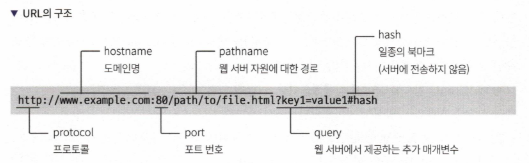
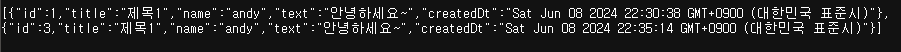

# 3장 Node.js와 익스프레스로 웹 애플리케이션 서버 구현하기

## 3.1 OK를 반환하는 서버 만들기
- Node.js로 모든 요청에 "OK"를 반환하는 서버 구현
- 코드 예제:


  ```javascript
  const http = require('http');
  const server = http.createServer((req, res) => {
    res.setHeader('Content-Type', 'text/html');
    res.end('OK');
  });
  server.listen(3000, () => console.log('OK 서버 시작!'));
  ```

## 3.2 라우터 만들기
- 다양한 경로에 대한 요청을 처리하는 라우터 추가
- 코드 예제:

```javascript
const http = require("http");
const url = require("url");
const server = http.createServer((req, res) => {
    const path = url.parse(req.url, true).pathname;
    res.setHeader("Content-Type", "text/html");

    if (path === "/user") {
        res.end("[user] name : andy, age: 30");
    } else if (path === "/feed") {
        res.end(`<ul>
        <li>pic1</li>
        <li>pic2</li>
        <li>pic3</li>
        </ul>`);
    } else {
        res.statusCode = 404;
        res.end("404 page not found");
    }
});

server.listen("3000", () => console.log("서버 시작"));
```

참고. URL 구조


## 3.3 createServer() 리팩터링하기
- 코드 리팩터링으로 가독성과 유지보수성 향상
- 코드 예제:

```javascript
const http = require("http");
const url = require("url");
const server= http.createServer((req, res) => {
    const path = url.parse(req.url, true).pathname;
    res.setHeader("Content-Type", "text/html");

    if (path === "/user") {
        user(req, res)
    } else if (path === "/feed") {
        feed(req, res)
    } else {
        res.statusCode = 404;
        res.end("404 page not found");
    }
}).listen("3000", () => console.log("서버 시작"));

const user = (req, res) => {
    res.end(`[user] name: andy, age: 30`);
}

const feed = (req, res) => {
    res.end(`<ul>
    <li>pic1</li>
    <li>pic2</li>
    <li>pic3</li>
    </ul>`);
};

```

## 3.4 동적으로 응답하기
- 요청에 따라 동적으로 응답 내용 변경
- 코드 예제:
  
```javascript
const http = require("http");
const url = require("url");
const server= http.createServer((req, res) => {
    const path = url.parse(req.url, true).pathname;
    res.setHeader("Content-Type", "text/html");

    if (path === "/user") {
        user(req, res)
    } else if (path === "/feed") {
        feed(req, res)
    } else {
        res.statusCode = 404;
        res.end("404 page not found");
    }
}).listen("3000", () => console.log("서버 시작"));

const user = (req, res) => {
    const userInfo = url.parse(req.url, true).query; // 쿼리 스트링 데이터 파싱
    res.end(`[user] name: ${userInfo.name}, age: ${userInfo.age}`);
}

const feed = (req, res) => {
    res.end(`<ul>
    <li>pic1</li>
    <li>pic2</li>
    <li>pic3</li>
    </ul>`);
};
  ```

http://localhost:3000/user?name=jk&age=1

## 3.5 라우터 리팩터링하기
- 라우터 코드를 map을 사용해서 리팩터링해서 코드 구조 개선
- 코드 예제:
  
```javascript
const http = require("http");
const url = require("url");

http.createServer((req, res) => {
    const path = url.parse(req.url, true).pathname;
    res.setHeader("Content-Type", "text/html");
    
    if (path in urlMap) {
        urlMap[path](req, res);
    } else {
        notFound(req, res);
    }
}).listen("3000", () => console.log("서버 시작"));

const user = (req, res) => {
    const userInfo = url.parse(req.url, true).query; // 쿼리 스트링 데이터 파싱
    res.end(`[user] name: ${userInfo.name}, age: ${userInfo.age}`);
};

const feed = (req, res) => {
    res.end(`<ul>
    <li>pic1</li>
    <li>pic2</li>
    <li>pic3</li>
    </ul>`);
};

const notFound = (req, res) => {
    res.statusCode = 404;
    res.end("404 page not found");
};


const urlMap = {
    "/": (req, res) => res.end("HOME"),
    "/user": user,
    "/feed": feed,
}
```

`urlMap` 이 `feed`, `notFound` 보다 아래 있는 이유는, `const` 로 선언한 변수들은 초기화 전에 읽을 수 없기 때문. 

```
Uncaught ReferenceError ReferenceError: Cannot access 'feed' before initialization
```

let, const, 함수 표현식, 클래스 표현식은 undefined 초기화 전에 접근할 수 없다.

## 3.6 익스프레스 프레임워크 사용하기

지금까지 Node.js 기본 라이브러리를 사용해 웹 서버를 만들어봤음. 그러나 실전에서는 라우터, 템플릿 엔진, 미들웨어 등의 기능이 필요함. 이를 위해 익스프레스(Express) 프레임워크를 사용해 웹 서버를 구축하는 방법을 설명함.

일반적으로 웹 서버가 제공하는 기능

| 항목                   | 설명                                                 |
| -------------------- | -------------------------------------------------- |
| 라우팅                  | URL 요청을 함수와 매핑시켜주는 기능                              |
| 정적 파일 서비스            | CSS, 자바스크립트, 이미지 등의 정적인 파일을 다루는 기능                 |
| 템플릿 엔진               | 동적인 웹페이지를 HTML과 인스턴스를 사용해 생성하는 기능                  |
| 요청(request) 데이터 다루기  | HTTP 요청을 추상화해 편리하게 다룰 수 있게 하는 기능                   |
| 응답(response) 데이터 다루기 | HTTP 응답을 커스터마이징할 수 있는 기능, 파일 내려받기, 이미지 출력 등        |
| 파일 업로드               | HTTP로 전송된 파일을 읽고 다룰 수 있는 기능                        |
| 쿠키 및 세션 지원           | 클라이언트 측 혹은 서버 측의 메모리에 일정 기간 동안 저장해야 하는 데이터를 다루는 기능 |
| 리다이렉트                | 서버의 응답 시 다른 페이지로 전환(redirect)시키는 기능                |
| 에러 페이지               | 요청이 잘못되었거나, 서버 에러 시 특정 에러 페이지를 보여주기                |
| 미들웨어                 | 요청 혹은 응답 사이에 공통된 기능을 추가하는 기능                       |

### 3.6.1 익스프레스 설치하기
- 익스프레스는 기본 라이브러리가 아님. 설치 필요.
- npm으로 설치:


  ```bash
  $ mkdir chapter3
  $ cd chapter3
  $ mkdir express-server
  $ cd express-server
  $ npm install express
  ```

### 3.6.2 나의 첫 익스프레스 서버 만들기
- 기본적인 익스프레스 서버 생성:


  ```javascript
const express = require("express");
const app = express();
const port = 3000;

app.get("/", (req, res) => {
    res.set({ "Content-Type": "text/html; charset=utf-8"});
    res.end("hello Express");
}).listen(port, () => {
    console.log(`Server running at http://localhost:${port}/`);
})
  ```

### 3.6.3 Node.js 라이브러리로 만든 서버를 익스프레스로 구현하기
- 기존 Node.js 서버 코드를 익스프레스로 변환:


  ```javascript
const url = require("url");
const express = require("express");
const app = express();
const port = 3000;

app.listen(port, () => {
    console.log(`Server running at http://localhost:${port}/`);
})

app.get("/", (_, res) => res.end("HOME"));
app.get("/user", user);
app.get("/feed", feed);

// 호이스팅 가능하도록 함수표현식 말고 함수로 변경 (로직을 아래 배치하는 코드 정리 목적?)
function user(req, res) {
    const user = url.parse(req.url, true).query;

    res.json(`[user] name: ${user.name}, age: ${user.age}`);
}

function feed(_, res) {
    res.json(`<ul>
    <li>pic1</li>
    <li>pic2</li>
    <li>pic3</li>
    </ul>`);
}
  ```
- URL 매핑을 app.get() 함수로 설정하여 코드 간결화.

## 3.7 익스프레스로 간단한 API 서버 만들기
- 익스프레스를 사용해 게시판 API 구현.
- 게시판 API 작성 예제:


```javascript
const express = require('express');
const app = express();
let posts = [];

// req.body 사용 위해 JSON 미들웨어 활성화
app.use(express.json())

// POST 요청 시 컨텐트 타입이 application... 인 경우 파싱
app.use(express.urlencoded({ extended: true}));

app.get("/", (req, res) => {
    res.json(posts);
})

app.post("/posts", (req, res) => {
    const { title, name, text} = req.body;

    posts.push({id:posts.length+1, title, name, text, createdDt: Date()});
    res.json({ title, name, text});
})

app.delete("/posts/:id", (req, res) => {
    const id = req.params.id;
    const filteredPosts = posts.filter((post) => post.id !== +id); // id를 숫자형으로 변환
    const isLengthChanged = posts.length !== filteredPosts.length;
    posts = filteredPosts;
    if (isLengthChanged) { // early return
        res.json("OK");
        return;
    }
    res.json("NOT CHANGED");
})

app.listen(3000, () => {
    console.log("post start");
})
```


## 3.8 게시판 API 테스트하기

### 3.8.1 curl로 GET 호출하기
- `curl -X GET http://localhost:3000` 명령어를 사용하여 서버에 GET 요청을 보냄.
- 현재 게시글이 없으므로 빈 배열 `[]`이 반환됨.
- `-X GET`은 기본값이므로 생략 가능, `curl localhost:3000`과 동일.

### 3.8.2 curl로 POST 호출해 게시글 등록하기
- POST 요청을 통해 게시글을 등록.
- 쓰기
    - `curl -X POST -H "Content-Type: application/x-www-form-urlencoded" -d "title=제목1&name=andy&text=안녕하세요~" http://192.168.0.13:3000/posts`
- 읽기
    - `curl -X GET http://192.168.0.13:3000`

### 3.8.3 curl로 DELETE 호출해 게시글 삭제하기
- 특정 게시글을 삭제하기 위해 DELETE 요청을 보냄.
- `curl -X DELETE http://192.168.0.13:3000/posts/2` 명령어를 사용하여 id가 2인 게시글을 삭제.
- 두 번째 DELETE 요청 시 "NOT CHANGED" 메시지 반환.


