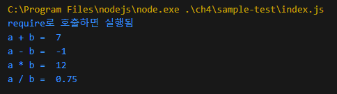
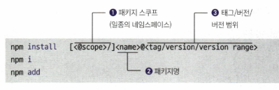
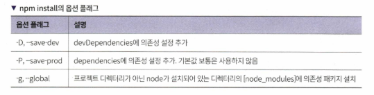
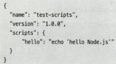
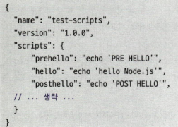
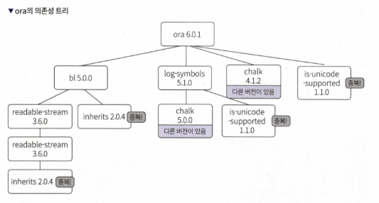
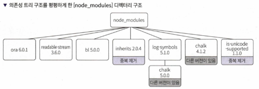
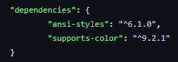

# 4장 npm과 yarn으로 패키지 관리하기

## 4.1 npm 소개

- **npm(Node Package Manager)**
  - Node.js의 기본 패키지 관리자
  - 오픈 소스 라이브러리 및 패키지를 쉽게 설치, 업데이트, 삭제 가능
  - CLI(Command Line Interface)를 통해 패키지 관리

## 4.2 패키지와 모듈

- **패키지**: 기능을 구현한 코드의 집합, `package.json` 파일로 정의됨
- **모듈**: 코드에서 특정 기능을 담당하는 개별 파일 또는 디렉터리
    - `node_modules` 디렉터리가 있는지 검사하면서 상위 디렉터리에 있는 패키지를 타고 올라가므로 많은 I/O를 수행하여 require() 함수가 무거워진다.
    - `yarn` 프로젝트로 해결한다.

## 4.3 package.json 파일을 만들기

- 프로젝트의 메타데이터와 의존성을 관리하는 파일
- `npm init` 명령어로 생성 가능
    - 예시: `npm init -y`로 기본 설정으로 생성

```js
console.log("require로 호출하면 실행됨")

module.exports = {
    add: (a, b) => a + b,
    sub: (a, b) => a - b,
    mul: (a, b) => a * b,
    div: (a, b) => a / b
}
```

```js
const calc = require("sample-package");

const a = 3;
const b = 4;

console.log("a + b = ", calc.add(a, b));
console.log("a - b = ", calc.sub(a, b));
console.log("a * b = ", calc.mul(a, b));
console.log("a / b = ", calc.div(a, b))
```



- **package.json 구성요소**

| 항목                       | 설명                                                                                            |
| ------------------------ | --------------------------------------------------------------------------------------------- |
| **name : 필수**            | 패키지명. 214자 글자 수 제한이 있음. 밑줄 또는 점으로 시작할 수 없음. 대문자를 허용하지 않음. URL 안전한 글자만 허용함.                    |
| **version : 필수**         | 패키지의 버전. 버전 정보는 node-semver로 파싱이 가능해야 함.                                                      |
| **description**          | 패키지 설명. npm search로 패키지 검색 시 나오는 설명문임.                                                        |
| **keywords**             | npm search로 패키지를 찾을 때 도움을 줌.                                                                  |
| **homepage**             | 프로젝트 홈페이지의 URL                                                                                |
| **bugs**                 | 버그를 제보할 이슈 트래커나 이메일 주소를 적습니다.                                                                 |
| **license**              | 라이선스 정보를 적습니다.                                                                                |
| **author, contributors** | 저자나 기여자의 정보를 기입합니다.                                                                           |
| **files**                | 패키지를 설치할 때 의존성으로 포함할 파일 리스트입니다. 하나씩 직접 지정할 수도 있고, "." 같은 패턴으로 넣을 수도 있습니다.                     |
| **main**                 | 모듈을 프로그램에서 가져다 사용하는 경우 진입점이 되는 파일입니다. 보통 index.js나 main.js를 사용합니다.                            |
| **bin**                  | 패키지에 실행 파일이 있는 경우 여기 지정합니다. npx 명령어를 사용하여 실행합니다.                                              |
| **man**                  | 리눅스에서 man 명령어로 사용할 수 있는 파일 정보를 기입합니다. man <패키지명>으로 사용합니다.                                     |
| **repository**           | 코드 저장소 주소를 기입합니다.                                                                             |
| **scripts**              | npm start, test 등의 npm으로 실행하는 스크립트 정보를 설정합니다. 유저가 커스텀하게 설정한 스크립트는 npm run <스크립트명>으로 실행 가능합니다. |
| **config**               | 패키지의 스크립트에서 사용할 환경 변수를 설정할 수 있습니다.                                                            |
| **dependencies**         | 의존성 패키지명과 버전을 맵의 형태로 관리합니다.                                                                   |
| **devDependencies**      | 테스트 시 필요한 의존성 패키지명과 버전을 맵의 형태로 관리합니다.                                                         |
| **peerDependencies**     | 다른 패키지에서 직접 require로 불러오는 것은 안되지만, 필요한 패키지를 만들어야 하는 경우 사용합니다. 주로 플러그인의 호환성 정보를 나타내는 데 사용합니다.  |
| **bundledDependencies**  | 패키지를 배포할 때 번들링되는 패키지 이름의 목록                                                                   |
| **optionalDependencies** | 사용을 원하는 패키지이지만, 없거나 설치가 실패해도 npm 설치가 중단되지 않도록 할 때 사용합니다.                                      |
| **engines**              | 동작 가능한 node 버전을 지정합니다.                                                                        |
| **os**                   | 어떤 운영체제에서 동작하는지 지정합니다.                                                                        |
| **private**              | true로 설정 시 publish 명령을 거부합니다.                                                                 |

> Node.js 패키지는 시맨틱 버전을 사용함. <메이저>.<마이너>.<패치> 형식으로 버전 표기
> 호환성 깨지면 메이저+1, 기능 추가하면 마이너+1, 버그 수정하면 패치+1

## 4.4 패키지 설치, 업데이트, 삭제

### 4.4.1 패키지 설치하기





package.json
```json
{
  "dependencies": {
    "lodash": "^4.17.21"
  }
}
```

package-lock.json
```json
{
  "name": "npm-install-test",
  "lockfileVersion": 3,
  "requires": true,
  "packages": {
    "": {
      "dependencies": {
        "lodash": "^4.17.21"
      }
    },
    "node_modules/lodash": {
      "version": "4.17.21",
      "resolved": "https://registry.npmjs.org/lodash/-/lodash-4.17.21.tgz",
      "integrity": "sha512-v2kDEe57lecTulaDIuNTPy3Ry4gLGJ6Z1O3vE1krgXZNrsQ+LFTGHVxVjcXPs17LhbZVGedAJv8XZ1tvj5FvSg=="
    }
  }
}

```


devDependency 는 개발 시에만 사용하는 패키지 정의하는 곳 (의존성에 포함되지 않음)

```console
npm install jest -D
```

```json
{
  "dependencies": {
    "lodash": "^4.17.21"
  },
  "devDependencies": {
    "jest": "^29.7.0"
  }
}

```

그냥 npm install 하면 package-lock.json 의 패키지를 설치한다.

git 저장소 주소로 설치도 된다.

```console
npm install <git 저장소 주소>[#버전]
```


### 4.4.2 패키지 업데이트하기

- 설치된 패키지를 최신 버전으로 업데이트
    - `npm update`

패키지명이 없으면 `package.json` 에 정의한 의존성 패키지를 전부 업데이트 한다

참고) 버전 표기는 다음과 같은 기준을 따른다.

| 의존성 버전 정보 정의 | 업데이트 범위               |
| ------------ | --------------------- |
| 4.4.2        | 4.4.2 고정              |
| >=4.0.0      | 4.0.0보다 큰 버전 중 최신 버전  |
| <5.0.0       | 5.0.0보다 작은 버전 중 최신 버전 |
| ~1.2.3       | 1.2.3 >=, <1.3.0      |
| ^1.2.3       | 1.2.3 >=, <2.0.0      |
| ^0.1.2       | 0.1.2 >=, <0.2.0      |

### 4.4.3 설치한 패키지 확인하기
- 현재 프로젝트에 설치된 패키지를 확인
    - `npm list`

### 4.4.4 패키지 삭제하기
- 설치된 패키지를 삭제
    - `npm uninstall express`

## 4.5 스크립트 기능과 NPX
### 4.5.1 npm 스크립트 파일을 정의하기
- `package.json` 파일 내 `scripts` 섹션에 명령어를 정의



```
npm run hello
```

위와 같이 스크립트 실행 가능

* run 없이 실행 가능한 스크립트
    * start, stop, test, restart

* 명령어 앞에 pre, post 붙이면  전후에 실행될 스크립트 지정됨
    * 


### 4.5.2 NPX로 코드 포매팅 명령어 prettier 실행하기

- NPX(Node Package eXecucte)
    - Node.js 패키지는 대부분 임포트해서 사용하지만, 개발 시 명령형 패키지를 다수 사용함(prettier, eslint, jest 등)
    - 실행하려면 node_modules/.bin/{패키지명} 경로로 명령어를 실행해야 함
    - `npx {패키지명} {파일명}`: 포맷팅 결과 콘솔에 출력
    - `npx {패키지명} -w {파일명}` : 포맷팅 결과 파일에 출력

```console
> npx prettier index.js
function getRandomInt(min, max /* 주석주석 */) {
  return Math.floor(Math.random() * (max - min)) + min;
}

console.log(getRandomInt(10, 20));
```


## 4.6 패키지 잠금


- **package-lock.json**: 의존성 버전 고정 및 일관된 설치 보장
    - 오픈 소스라 하위 호환성이 엄격히 관리되지 않음.
    - 패키지 설치 시 의존성 트리를 기록하여 동일한 종속성 트리를 보장함.
        - `package-lock.json`은 `node_modules`나 `package.json`을 변경하는 모든 명령(`npm install`, `npm update`, `npm uninstall`)이 실행될 때 함께 변경됨.
        - `package.json`에 명시된 패키지 버전 범위가 아니라, 특정 버전을 기록하여 설치 시 항상 동일한 버전을 설치할 수 있도록 함.
        - 즉 현재 설치에서 잘 동작한다면 다른 곳에서도 잘 동작함을 보장
    - `npm ci` 명령어
        - `npm ci`는 `package-lock.json` 파일을 기준으로 의존성 패키지를 설치함.
        - `npm install`과 달리, `npm ci`는 `package.json`을 참조하지 않으며, `node_modules` 디렉터리를 삭제하고 다시 설치함.
        - `packpage.json`을 변경하지 않음.
        - `npm ci`는 테스트 서버나 프로덕션 환경에서 사용하기 적합함.




- 의존성 트리
    - `npm ls --depth=2`
    - 의존성 패키지를 끌어올려서(hoisting) 평탄화하고 중복 패키지를 제거하여 관리
- 유령의존성
    - 위로 끌어올렸을 때 package.json에 정의하지 않은 의존성 패키지를 사용할 수 있게 해준다.
        - 직관적이지 않아서 좋지 않
## 4.7 npm의 대안 yarn

- **Yarn**: Facebook에서 개발한 패키지 관리자
  - 성능과 보안에 중점을 둠
  - 병렬 처리 및 캐싱 기능 제공
  - PnP(Plug'n'Play) 전략 사용, `node_modules` 디렉터리를 사용하지 않음

```
corepack enable // 설치 (관리자 권한 필)
yarn init -2 // 초기화
```

Yarn의 주요 명령어
- `yarn add <패키지명>`: 패키지 설치
- `yarn remove <패키지명>`: 패키지 제거
- `yarn upgrade <패키지명>`: 패키지 업데이트

PnP(Plug'n'Play) 전략
- PnP는 `node_modules` 디렉터리를 사용하지 않고 종속성을 관리하는 전략이다.
- `.pnp.cjs` 파일에 종속성을 정의하며, 패키지 파일은 압축 파일 형태로 `.yarn/cache` 디렉터리에 저장된다.
- PnP를 사용하면 패키지 설치 시간이 단축되고, 서버의 기동 속도가 빨라진다.

Zero-Install
- Zero-Install은 패키지를 코드 저장소에 직접 저장하여, 배포 시 패키지 설치가 필요 없도록 하는 전략이다.
- 버전 불일치로 인한 버그를 방지할 수 있다.

```
yarn node main.js
```

또다른 패키지 매니저
- pnpm
- 심볼릭 링크를 사용해 패키지 중복 설치 없애는 전략

yarn에서 지원하지 않는 기능을 사용하는 패키지도 있으므로 일단 npm 사용.

ex) chalk 패키지는 imports 속성을 쓰는데 yarn2에서 지원하지 않았었... 다고 나오는데 지금 해보면 됨. 



누가 PR 보낸듯 
