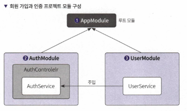
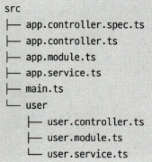
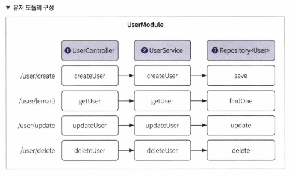
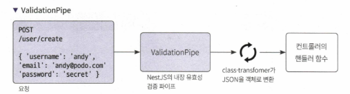
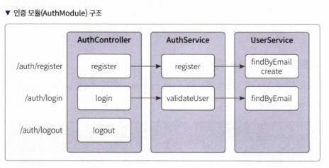
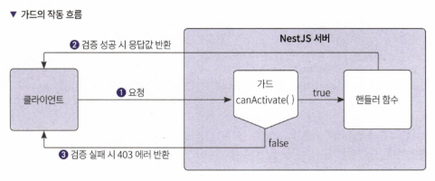
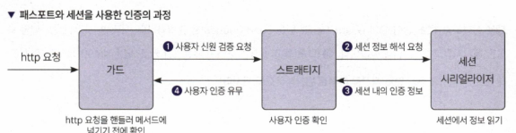
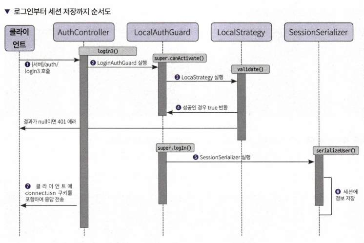

# 10장 회원 가입과 인증하기

## 10.1 실습용 프로젝트 설정하기
### 10.1.1 프로젝트 생성하기


### 10.1.2 User 모듈 생성하기
- `nest g module user`
- `nest g controller user --no-spec`
- `nest g service user --no-spec`


### 10.1.3 SQLite 데이터베이스 설정

```
npm install sqlite3 typeorm @nestjs/typeorm
```


## 10.2 유저 모듈의 엔티티, 서비스, 컨트롤러 생성하기

### 10.2.1 엔티티 만들기
- 유저 엔티티는 데이터베이스 테이블과 1:1로 매핑되는 객체
- 작성할 유저 엔티티 속성: `id`, `email`, `username`, `password`, `createdDt`
- `@Entity()` 데코레이터 사용

```typescript
// 데코레이터 임포트
import { Column, Entity, PrimaryGeneratedColumn } from 'typeorm';

@Entity()  // 엔티티 객체임을 알려주기 위한 데코레이터
export class User {
  @PrimaryGeneratedColumn()  // id는 pk이며 자동 증가하는 값
  id?: number;

  @Column({ unique: true })  // email은 유니크한 값
  email: string;

  @Column()
  password: string;

  @Column()
  username: string;

  @Column({ default: true })  // 기본값을 넣어줌
  createdDt: Date = new Date();
}
```

### 10.2.2 컨트롤러 만들기


  
- 유저 요청 시 실행되는 핸들러 메서드
    - 유저 추가
    - 로그인에 사용할 1명 유저 찾기
    - 정보 업데이트
    - 삭제

```ts
import { Body, Controller, Get, Post, Param, Put, Delete } from '@nestjs/common';
import { User } from './user.entity';
import { UserService } from './user.service';

@Controller('user')  // 컨트롤러 설정 데코레이터
export class UserController {
  constructor(private userService: UserService) {}  // 유저 서비스 주입

  @Post('/create')  // 유저 생성
  createUser(@Body() user: User) {
    return this.userService.createUser(user);
  }

  @Get('/getUser/:email')  // 한 명의 유저 찾기
  async getUser(@Param('email') email: string) {
    const user = await this.userService.getUser(email);
    console.log(user);
    return user;
  }

  @Put('/update/:email')  // 유저 정보 업데이트
  updateUser(@Param('email') email: string, @Body() user: User) {
    console.log(user);
    return this.userService.updateUser(email, user);
  }

  @Delete('/delete/:email')  // 유저 삭제
  deleteUser(@Param('email') email: string) {
    return this.userService.deleteUser(email);
  }
}
```

### 10.2.3 서비스 만들기

- 컨트롤러와 리포지토리 이어주는 역할
    - 유저 데이터 생성
    - 특정 유저 정보 가져오기/수정/삭제

## 10.3 파이프로 유효성 검증하기



### 10.3.1 전역 ValidationPipe 설정하기

- **전역 ValidationPipe**를 설정하여 입력값의 유효성을 검증할 수 있음.
- NestJS에서는 다양한 파이프를 제공하며, ValidationPipe는 가장 사용하기 간편함.
- `class-validator`와 `class-transformer` 라이브러리를 설치해야 함.

#### ValidationPipe 설정 방법

```
npm install class-validator class-transformer
```

1. `main.ts` 파일에서 전역 파이프 설정
   ```typescript
   import { ValidationPipe } from '@nestjs/common';
   import { NestFactory } from '@nestjs/core';
   import { AppModule } from './app.module';

   async function bootstrap() {
     const app = await NestFactory.create(AppModule);
     app.useGlobalPipes(new ValidationPipe());
     await app.listen(3000);
   }
   bootstrap();
   ```

### 10.3.2 UserDto 만들기

- **Data Transfer Object (DTO)**를 사용하여 데이터의 구조를 정의하고 유효성을 검증함.
- `class-validator` 데코레이터를 사용하여 유효성 규칙을 정의.
    - 다양한 규칙 제공하고 있음

  ```typescript
  import { IsEmail, IsString } from 'class-validator';

  export class CreateUserDto {
    @IsEmail()
    email: string;

    @IsString()
    password: string;

// 중략
  }
  ```

### 10.3.3 테스트하기
- DTO와 ValidationPipe 설정이 제대로 작동하는지 확인하기 위해 테스트 코드를 작성함.
- 유효하지 않은 데이터가 들어왔을 때 적절한 에러 메시지가 반환되는지 검증.

## 10.4 인증 모듈 생성 및 회원 가입하기

- 인증
    - 정확성, 시간 측면에서 사용자의 자격증명을 확인
    - 정확성: 사용자 자격증명 확인 후 인증 토큰 발급
    - 시간: 사용자에게 부여된 인증 토큰은 특정 기간 동안 유효
- 방법
    - 쿠키
        - 장점: 하위 도메인에서 같은 세션 사용, 저장 공간 적음, 브라우저에서 관리, httpOnly 설정 시 클라에서 js로 조작 불가
        - 단점: CSRF(사이트 간 위조 공격)이 있을 수 있음, 서버 저장해야 함, API 인증으로는 나쁨
    - 토큰
        - 장점: 유연하고 간단, 크로스 플랫폼 대응, 다양한 프론트앱에서 사용 가능
        - 단점: 누출 시 권한 삭제 어려움 (무상태성), 쿠키보다 공간 차지 큼, JWT 내부 정보는 토큰 생성 시 데이터라 최신 데이터 반영되지 않을 수 있음



## 10.5 쿠키를 사용한 인증 구현하기

- AuthController에 login 핸들러 메서드 필요
- AuthService에 email, password 넘겨주면 해당 정보의 유저가 있는지 유효성 검증 로직 필요
- 인증 구현 시 인증용 미들웨어 Guard를 함께 사용함
    - 특정 상황(권한, 롤, 액세스컨트롤)에서 받은 요청을 가드를 추가한 라우트 메서드에서 처리할지 말지 결정하는 역할



## 10.6 패스포트와 세션을 사용한 인증 구현

- 보안 강화를 위해 세션을 사용
    - 이때 쿠키는 세션을 찾는 정보만 저장(세션의 아이디값)
    - 중요 정보는 세션에 넣는 것이 좋음
    - 서버 부하를 주지만 보안적으로 안전



- 흐름
    - 가드를 통과한 요청은 스트래티지에 전달되어 사용자 신원 검증
    - 스트래티지는 세션 정보를 읽기 위해 세션 시리얼라이저 세션에 있는 인증 정보 요청
    - 세션 시리얼라이저는 세션에 있는 인증 정보를 돌려줌
    - 스트래티지는 세션에 있는 인증 정보를 확인해 사용자 인증 유무를 가드에 반환



로그인 시퀀스